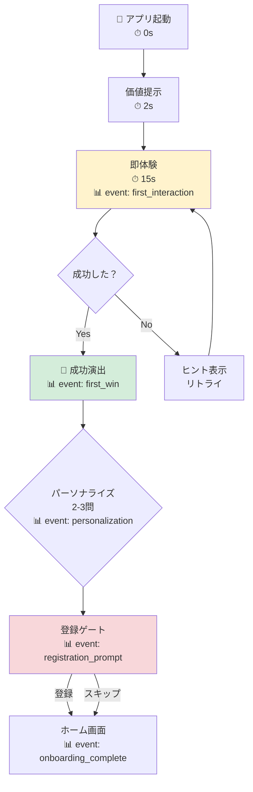

# App Onboarding Design Skill

アプリのオンボーディングを設計・改善するための汎用スキル。
「Aha Momentへの最短到達」を最優先とし、離脱率最小化 → パーソナライズ → 計測設計の順で最適化する。

## 設計哲学

以下の3原則を常に守る：

1. **Value Before Registration** — 登録前に価値を体験させる。体験してから登録を求める
2. **Learn by Doing** — 説明スライドではなく、実際の操作を通じて学ばせる。ツールチップ5個の連打は厳禁
3. **First Win in 60 Seconds** — 初回起動から60秒以内に「できた」感を提供する

## Step 0: Aha Moment を定義する

オンボーディング設計の起点は、アプリ固有の Aha Moment を具体的に定義すること。
以下のテンプレートで定義する：

```markdown
### [アプリ名]
- **Aha Moment**: ユーザーが「このアプリの価値がわかった」と感じる瞬間
- **Activation Metric**: Aha Moment到達を示す計測可能な行動
- **Target TTV (Time to Value)**: Aha Moment到達までの目標秒数
- **Day1 Retention目標**: 翌日再訪率の目標値（アプリカテゴリ平均を参考に）
- **習慣化トリガー**: 継続利用を促す最初のフック
```

**定義のコツ:**
- Aha Moment は「機能を使えた」ではなく「価値を感じた」瞬間
- Activation Metric は定量計測可能であること
- TTV は短いほど良いが、カテゴリにより適正値は異なる（ユーティリティ: 30秒、学習: 60秒、クリエイティブ: 120秒）

**参考事例:**

| アプリ | Aha Moment | Activation Metric |
|--------|-----------|-------------------|
| Duolingo | 初回レッスン完了 + XP獲得 | レッスン1つ完了 |
| Spotify | 自分好みのプレイリスト生成 | 3アーティスト選択完了 |
| Canva | 最初のデザイン完成 | テンプレート編集 → 保存 |
| Headspace | 初回瞑想後の落ち着き | 3分の体験瞑想完了 |
| Notion | テンプレートで最初のページ作成 | ページ1件作成 |

---

## オンボーディング設計フレームワーク

以下の6フェーズで設計する。各フェーズには必須チェック項目がある。

### Phase 0: Pre-Onboarding（インストール前〜起動まで）
- [ ] ストア説明文が「ユーザーのBetter Self」を描写しているか
- [ ] スクリーンショットが機能ではなく成果を見せているか
- [ ] アプリサイズが初回DLの心理的障壁を超えていないか（目安100MB以下）

### Phase 1: First Contact（起動〜最初のインタラクション、0-15秒）
- [ ] スプラッシュ画面は2秒以内か
- [ ] 最初の画面で「何ができるアプリか」が3秒で伝わるか
- [ ] 登録を要求する前に価値体験があるか（Value Before Registration）
- [ ] Empty Stateではなくサンプルデータ or 即時体験を提供しているか

### Phase 2: Quick Win（最初の成功体験、15-60秒）
- [ ] ユーザーが1アクションで「できた」を感じられるか
- [ ] フィードバック（音・アニメーション・テキスト）が即座に返るか
- [ ] 正解/成功時のポジティブ強化が十分か
- [ ] 操作ステップ数は3以下か

### Phase 3: Personalization（ユーザー分岐、60-120秒）
- [ ] 目的・レベルを2-3問で聞いているか（5問以上は離脱リスク）
- [ ] 回答に基づいて体験が実際に変わるか（見せかけのパーソナライズは逆効果）
- [ ] 「スキップ」が常に可能か
- [ ] パーソナライズ結果が初回セッション内で体感できるか

### Phase 4: Registration Gate（登録・アカウント作成）
- [ ] Quick Win達成後に配置されているか
- [ ] ソーシャルログイン（Apple/Google）を最優先表示しているか
- [ ] メールアドレスのみの最小フォームか
- [ ] 「登録しないと失われるもの」を明示しているか（進捗データの保存等）
- [ ] 登録スキップしても一定範囲は使えるか

### Phase 5: Habit Loop Setup（習慣化の種まき、初回セッション終了時）
- [ ] リマインダー/通知の許可を価値体験の後に求めているか
- [ ] 次回やることが明確か（「明日のチャレンジ」等）
- [ ] プログレスバー or ストリークが設定されているか
- [ ] ウィジェット/ショートカットの案内があるか

### Phase 6: Re-engagement（Day1-7の再訪促進）
- [ ] Day1プッシュ通知の文面がパーソナライズされているか
- [ ] 離脱ポイントに基づく再訪メッセージがあるか
- [ ] 「前回の続き」が1タップで再開できるか
- [ ] ストリーク継続のインセンティブがあるか

---

## 出力モード

このスキルは4つの出力モードを持つ。ユーザーの要求に応じて適切なモードを選択する。
複数モードの同時出力も可能。

### Mode 1: チェックリスト＋改善レポート
既存のオンボーディングを診断し、上記フレームワークに基づいてスコアリング＋改善提案を行う。

出力テンプレート:
```markdown
# [アプリ名] オンボーディング診断レポート

## サマリー
- 総合スコア: X/30（各Phase 0-5点）
- 最大の改善機会: [Phase名]
- 推定インパクト: Day1 Retention +X%

## Phase別診断
### Phase 1: First Contact — X/5
✅ 達成項目
❌ 未達成項目
💡 改善提案（優先度・工数目安付き）

...（各Phase繰り返し）

## 優先アクション TOP3
1. [最もインパクトの大きい改善]
2. [次に重要な改善]
3. [コスト対効果の高い改善]
```

### Mode 2: フロー設計書（Mermaid）
オンボーディングフロー全体をMermaid図で出力する。
分岐条件、離脱ポイント、計測ポイントを明示する。

設計ルール:
- 各ノードに推定所要時間を付記する
- 離脱リスクの高いノードを赤系で色分けする
- 計測イベント名をノード下に記載する
- パーソナライズ分岐を菱形ノードで表現する

出力例:


### Mode 3: ワイヤーフレーム指示書
各画面の構成要素・レイアウト・インタラクションを開発者が実装できるレベルで記述する。

出力テンプレート（各画面ごと）:
```markdown
## Screen: [画面名]
- **目的**: この画面でユーザーが得るもの
- **前の画面**: [画面名]
- **次の画面**: [画面名] / 分岐先
- **レイアウト**:
  - 上部: [要素の説明]
  - 中央: [メインコンテンツ]
  - 下部: [CTA・ナビゲーション]
- **インタラクション**:
  - タップ: [動作]
  - スワイプ: [動作]
  - 自動遷移: [条件と秒数]
- **計測イベント**: [イベント名とプロパティ]
- **離脱対策**: [この画面特有の対策]
```

### Mode 4: コード生成（React / SwiftUI）
オンボーディング画面のプロトタイプコードを生成する。

技術スタック:
- **Web（React）**: Tailwind CSS、Framer Motion
- **iOS（SwiftUI）**: iOS 16+対応、@State/@Binding でフロー管理

コード生成ルール:
- 1画面1コンポーネント、画面遷移はステートマシンで管理
- アニメーションは控えめだが、成功時のフィードバックは華やかに
- アクセシビリティ（VoiceOver/TalkBack）を考慮
- 計測イベントの発火ポイントをコメントで明示

---

## 計測設計テンプレート

オンボーディングの効果を計測するために、以下のイベント体系を標準とする。

### 必須イベント
| イベント名 | 発火タイミング | プロパティ |
|---|---|---|
| `app_first_open` | 初回起動 | device, os_version, source |
| `onboarding_start` | オンボーディング開始 | - |
| `first_interaction` | 最初の操作 | interaction_type, time_from_open |
| `first_win` | 最初の成功体験 | win_type, time_from_start |
| `personalization_complete` | パーソナライズ完了 | selections, skipped |
| `registration_prompt` | 登録ゲート表示 | trigger_point |
| `registration_complete` | 登録完了 | method(apple/google/email) |
| `registration_skip` | 登録スキップ | - |
| `onboarding_complete` | オンボーディング完了 | total_time, steps_completed |
| `onboarding_abandon` | オンボーディング離脱 | last_step, time_spent |

### ファネル定義
```
app_first_open
  → first_interaction （目標: 90%以上）
    → first_win （目標: 75%以上）
      → registration_prompt （目標: 70%以上）
        → registration_complete （目標: 40%以上）
          → onboarding_complete （目標: 35%以上）
```

### KPI定義
- **Activation Rate**: `onboarding_complete / app_first_open` — 目標35%以上
- **Time to First Value (TTV)**: `first_win.timestamp - app_first_open.timestamp` — 目標60秒以内
- **Registration Conversion**: `registration_complete / registration_prompt` — 目標50%以上
- **Day1 Retention**: 翌日再訪率 — 目標30%以上
- **Day7 Streak Rate**: 7日中3日以上アクティブ — 目標15%以上

---

## オンボーディングパターン分類

アプリの性質に応じて、最適なパターンを選択する：

| パターン | 適するアプリ | 代表例 |
|---------|-------------|--------|
| Learn by Doing | スキル習得・学習系 | Duolingo, ToneGym |
| Value Before Registration | 即時結果が出せる系 | Wise, Canva |
| Personalization-first | コンテンツ推薦系 | Spotify, Headspace |
| Progressive Disclosure | 多機能ツール系 | Notion, LinkedIn |
| Gradual Engagement | 登録ハードルが高い系 | Duolingo |

複数パターンの組み合わせが有効。Primary + Secondary で設計する。

---

## 反面教師パターン（避けるべき設計）

1. **情報過多ウェルカムスライド**: 3枚以上の説明スライドはスキップ率が急上昇
2. **価値体験前の登録強制**: 登録→通知→価値の順番は動機付け失敗
3. **過剰なパーミッション要求**: 起動直後にカメラ・位置情報・通知を一括要求
4. **見せかけのパーソナライズ**: 質問だけして体験が変わらない → 信頼喪失
5. **長すぎるチュートリアル**: ツールチップ5個以上の連打 → 80%がスキップ
6. **空のホーム画面**: 登録完了後に何もない画面 → 次のアクションがわからず離脱
7. **短期的圧力戦術**: 「今だけ50%OFF」等のオンボーディング中のプレッシャー → 信頼毀損

---

## 使い方ガイド

1. **新規オンボーディング設計**: Step 0 で Aha Moment 定義 → Phase 0-6 を順に設計 → Mode 2 でフロー図 → Mode 3 でワイヤーフレーム → Mode 4 でプロトタイプ
2. **既存オンボーディング改善**: Mode 1 で診断レポート → 最大の改善機会を特定 → Mode 2 で改善後フロー設計 → 実装
3. **A/Bテスト設計**: 計測設計テンプレートを適用 → 変更箇所の仮説を明文化 → テスト期間・サンプルサイズを算出

## リファレンス

詳細な情報が必要な場合は以下を参照：
- `references/research-digest.md` — オンボーディング研究の要約とエビデンス集
