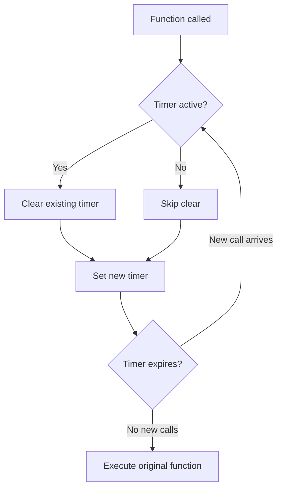
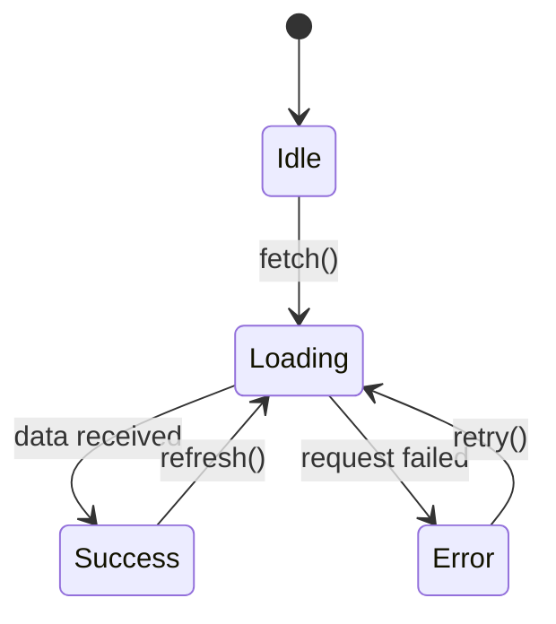

# Code Explainer Skill

## Purpose

Make code understandable to the reader at their level. This skill explains code at configurable depths — from a one-sentence summary to a line-by-line breakdown — while identifying patterns, complexity, and potential issues. The goal is not just to describe what code does, but to build understanding of why it works.

## Key Concepts

### Depth Levels

| Level | When to Use | Output |
|-------|-------------|--------|
| **L1: Overview** | Quick understanding, PR review | 1-3 sentence summary of purpose |
| **L2: Standard** | Code review, onboarding | Purpose, flow, key decisions, complexity |
| **L3: Detailed** | Learning, debugging | Step-by-step walkthrough with reasoning |
| **L4: Line-by-Line** | Deep debugging, teaching | Every line explained with context |

### Audience Calibration

| Audience | Assumes Knowledge Of | Explains |
|----------|---------------------|----------|
| **Beginner** | Basic syntax, variables, functions | Data structures, patterns, language idioms |
| **Intermediate** | Common patterns, standard library | Architecture decisions, trade-offs, edge cases |
| **Advanced** | Design patterns, complexity theory | Non-obvious optimizations, subtle bugs, alternatives |

## Workflow

### Step 1: Read and Classify

Before explaining, identify:
1. **Language and framework** — Determines idioms and conventions
2. **Purpose** — What problem does this code solve?
3. **Patterns used** — Design patterns, architectural patterns
4. **Complexity** — Time and space complexity
5. **Dependencies** — What external code does this rely on?
6. **Edge cases** — What inputs could cause unexpected behavior?

### Step 2: Explain at Requested Depth

#### L1: Overview

```typescript
// Code to explain:
export function debounce<T extends (...args: unknown[]) => unknown>(
  fn: T,
  delay: number
): (...args: Parameters<T>) => void {
  let timeoutId: ReturnType<typeof setTimeout>;
  return (...args: Parameters<T>) => {
    clearTimeout(timeoutId);
    timeoutId = setTimeout(() => fn(...args), delay);
  };
}
```

**L1 Explanation:**
> This is a `debounce` utility that delays function execution until a pause in calls. If the function is called repeatedly within the delay window, only the last call executes. Common use: preventing excessive API calls during user typing.

#### L2: Standard

**L2 Explanation:**

> **Purpose:** Creates a debounced version of any function. The debounced function waits for `delay` milliseconds of inactivity before executing.
>
> **How it works:**
> 1. Returns a wrapper function that captures the original function in a closure
> 2. Each call clears any pending timeout and sets a new one
> 3. The original function only executes when no new calls arrive within the delay period
>
> **Pattern:** Closure + Timer control (common in event handling)
>
> **Complexity:** O(1) time per call, O(1) space (one timeout reference)
>
> **TypeScript notes:** Generic type `T` preserves the original function's parameter types via `Parameters<T>`. Return type is `void` because the debounced function does not return the original's result (it executes asynchronously).
>
> **Common usage:** Search input handlers, window resize listeners, form auto-save

#### L3: Detailed

**L3 Explanation:**

> **Context:** Debouncing is a rate-limiting technique. Imagine a user typing in a search box. Without debouncing, every keystroke triggers an API call. With debouncing, the API call only fires after the user stops typing for a specified duration.
>
> **Step-by-step flow:**
>
> ```
> Call 1 at t=0ms:   Clear timer → Set timer for t=300ms
> Call 2 at t=100ms: Clear timer (cancels t=300ms) → Set timer for t=400ms
> Call 3 at t=200ms: Clear timer (cancels t=400ms) → Set timer for t=500ms
> [user stops typing]
> t=500ms: Timer fires → Original function executes with Call 3's arguments
> ```
>
> **Closure analysis:**
> - `timeoutId` lives in the closure created by `debounce()`, shared across all calls to the returned function
> - `fn` and `delay` are also captured in this closure
> - Each new call to the returned function resets the shared `timeoutId`
>
> **Type system breakdown:**
> - `T extends (...args: unknown[]) => unknown` — T is any function type
> - `Parameters<T>` — Extracts T's parameter types as a tuple
> - `ReturnType<typeof setTimeout>` — Platform-agnostic timeout ID type (number in browser, NodeJS.Timeout in Node)
>
> **Potential issues:**
> - The return value of `fn` is discarded (cannot `await` a debounced async function)
> - No `cancel()` method — once queued, the final call always executes
> - No `flush()` method — cannot force immediate execution
> - Memory: the closure holds a reference to `fn` and its bound context
>
> **Improved version would add:**
> ```typescript
> const debounced = (...args) => { ... };
> debounced.cancel = () => clearTimeout(timeoutId);
> debounced.flush = () => { clearTimeout(timeoutId); fn(...lastArgs); };
> return debounced;
> ```

#### L4: Line-by-Line

```
Line 1:  export function debounce<T extends (...args: unknown[]) => unknown>(
         │ export    — Makes this function importable from other modules
         │ function  — Named function declaration (hoisted, better stack traces than arrow)
         │ <T extends (...args: unknown[]) => unknown>
         │            — Generic type parameter T, constrained to be any function
         │            — This lets TypeScript infer the exact parameter types of the input function

Line 3:    fn: T,
         │ The original function to debounce, typed as T

Line 4:    delay: number
         │ Milliseconds to wait after last call before executing

Line 5:  ): (...args: Parameters<T>) => void {
         │ Return type: a function with same parameters as T, but returning void
         │ (because execution is deferred, we can't return T's return value synchronously)

Line 6:    let timeoutId: ReturnType<typeof setTimeout>;
         │ Declared in outer scope — shared across all invocations of the returned function
         │ ReturnType<typeof setTimeout> handles both browser (number) and Node (Timeout)
         │ Using `let` because it will be reassigned on each call

Line 7:    return (...args: Parameters<T>) => {
         │ Return a new function that captures fn, delay, and timeoutId in its closure

Line 8:      clearTimeout(timeoutId);
         │ Cancel any previously scheduled execution
         │ Safe to call even if timeoutId is undefined (clearTimeout handles it)

Line 9:      timeoutId = setTimeout(() => fn(...args), delay);
         │ Schedule fn to execute after `delay` ms
         │ Arrow function captures `args` from this specific call
         │ Assigns new timeout ID so next call can cancel it

Line 10:   };
Line 11: }
```

### Step 3: Identify Patterns and Concepts

When explaining code, call out recognized patterns:

```
Design Patterns:
  - Singleton          - Factory           - Observer
  - Strategy           - Decorator         - Adapter
  - Command            - State Machine     - Builder
  - Repository         - Middleware chain   - Pub/Sub

Algorithmic Patterns:
  - Two pointers       - Sliding window    - Divide and conquer
  - Dynamic programming - Greedy           - Backtracking
  - BFS/DFS            - Binary search     - Memoization

Architectural Patterns:
  - MVC / MVVM         - Event-driven      - CQRS
  - Microservices      - Hexagonal         - Layered
  - Saga               - Circuit breaker   - Bulkhead
```

### Step 4: Complexity Analysis

Always include when relevant:

```
Time Complexity:
  Best case:    O(...)
  Average case: O(...)
  Worst case:   O(...)

Space Complexity: O(...)

Explanation: [Why this complexity, what dominates]
```

Example:
```
This function uses a hash map for O(1) lookups inside a loop that
iterates n items, giving O(n) total time. The hash map stores at
most n entries, so space is also O(n).

Compared to the naive O(n^2) nested loop approach, this trades
O(n) extra memory for O(n) time improvement.
```

## Explanation Formatting

Structure explanations consistently:

```markdown
## [Function/Module Name]

**Purpose:** One sentence.

**Pattern:** [Design pattern if applicable]

**Flow:**
1. First thing that happens
2. Second thing
3. Third thing

**Complexity:** Time O(n), Space O(1)

**Key Insight:** [The non-obvious thing that makes this work]

**Watch Out For:** [Edge cases, gotchas, limitations]
```

## Visual Aids

For complex flows, include Mermaid diagrams:



For state machines:



## Anti-Patterns in Explanation

1. **Narrating syntax** — "The `const` keyword declares a constant" (reader knows this)
2. **Ignoring context** — Explaining a function without explaining its role in the system
3. **Skipping the WHY** — Describing what each line does without explaining why this approach was chosen
4. **Assuming knowledge** — Using jargon without checking if the audience knows it
5. **Over-explaining** — Giving L4 depth when L2 was requested
