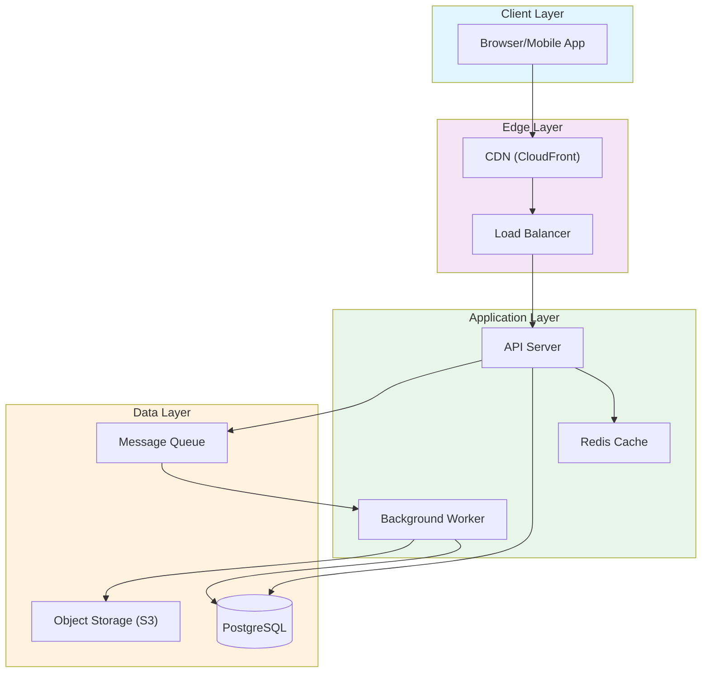
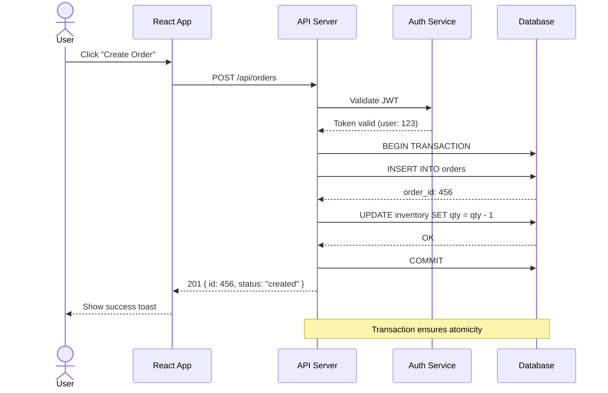
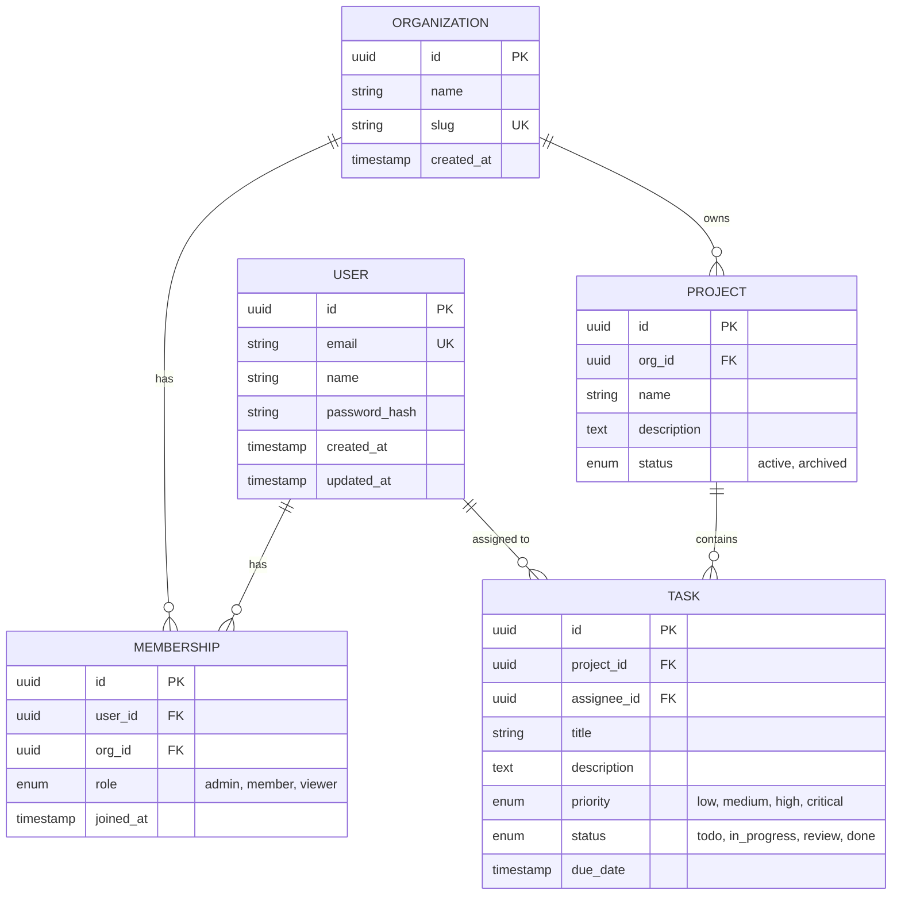
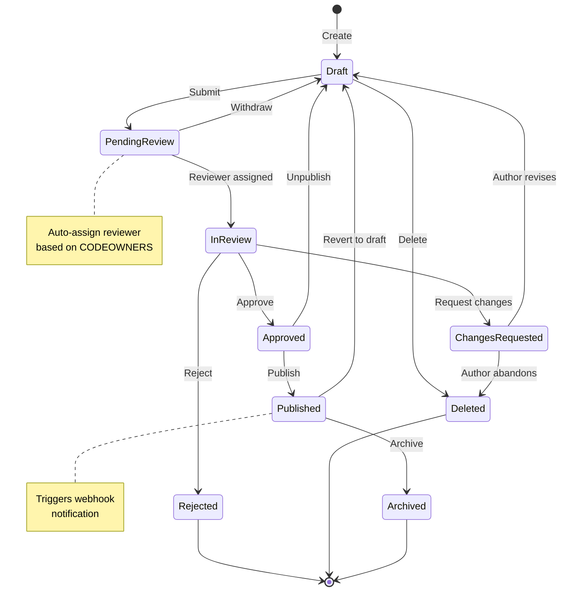
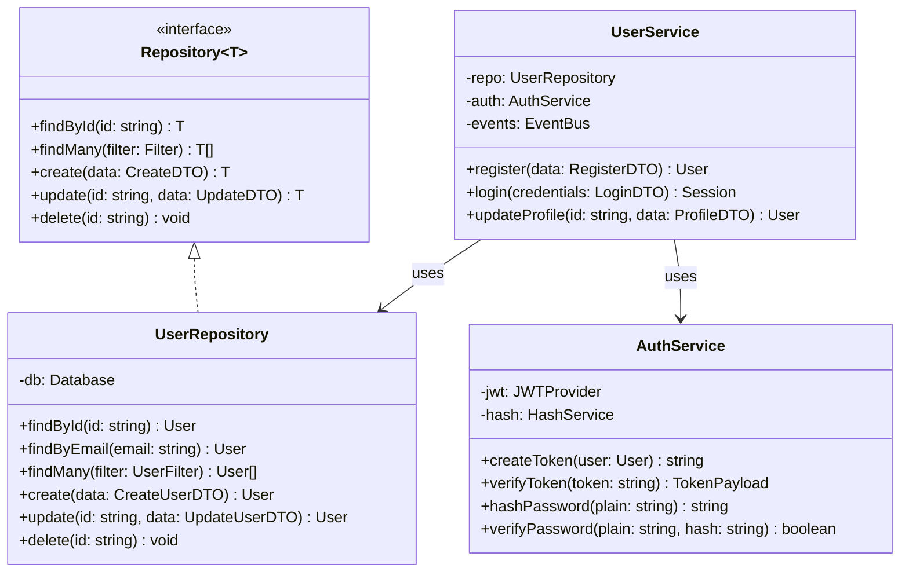
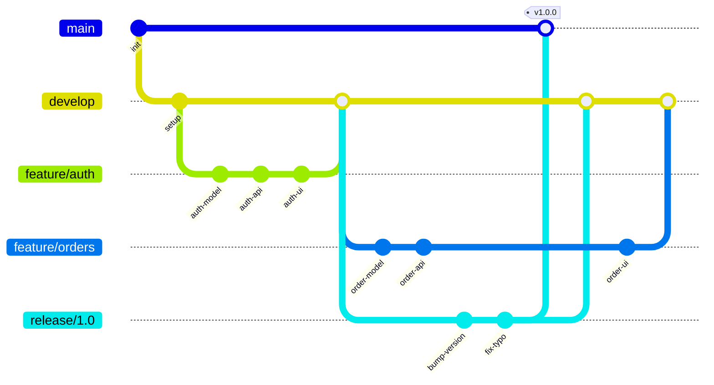
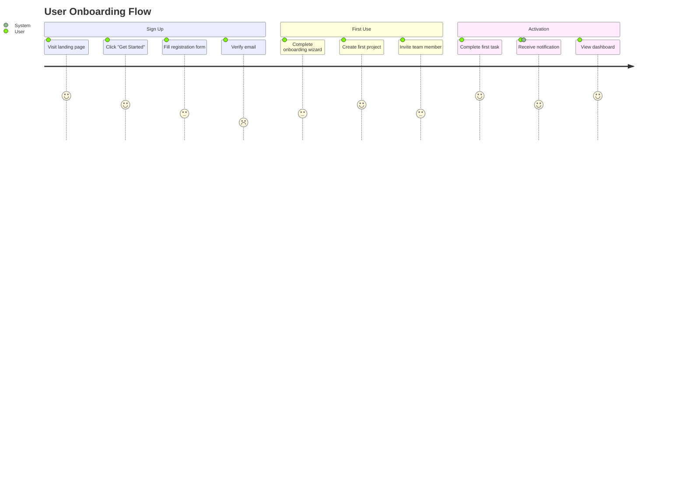

# Mermaid

## Purpose

This skill generates precise, valid Mermaid diagram syntax from natural language descriptions, code analysis, or structured data. Mermaid diagrams are version-controllable, embeddable in Markdown, and renderable in GitHub, GitLab, Notion, and most documentation platforms.

## Key Concepts

### Diagram Type Selection Guide

| You Want To Show... | Use This Diagram | Mermaid Type |
|---------------------|-----------------|--------------|
| Process flow with decisions | Flowchart | `flowchart TD/LR` |
| Request/response between services | Sequence Diagram | `sequenceDiagram` |
| Database tables and relationships | ER Diagram | `erDiagram` |
| Object-oriented class structure | Class Diagram | `classDiagram` |
| State transitions | State Diagram | `stateDiagram-v2` |
| Project timeline | Gantt Chart | `gantt` |
| Proportional data | Pie Chart | `pie` |
| Git branching | Git Graph | `gitGraph` |
| Hierarchical concepts | Mindmap | `mindmap` |
| User journey steps | User Journey | `journey` |

### Syntax Fundamentals

**Direction**: `TD` (top-down), `LR` (left-right), `BT` (bottom-top), `RL` (right-left)

**Node Shapes**:
```
id[Rectangle]
id(Rounded)
id{Diamond/Decision}
id([Stadium])
id[[Subroutine]]
id[(Database)]
id((Circle))
id>Asymmetric]
id{{Hexagon}}
```

**Edge Types**:
```
A --> B          Solid arrow
A --- B          Solid line (no arrow)
A -.-> B         Dotted arrow
A ==> B          Thick arrow
A -- text --> B   Labeled edge
A -->|text| B    Labeled edge (alternative)
```

## Diagram Templates

### Template 1: System Architecture Flowchart



### Template 2: API Request Sequence



### Template 3: Entity Relationship Diagram



### Template 4: State Machine



### Template 5: Class Diagram



### Template 6: Git Branching Strategy



### Template 7: User Journey



## Generation Workflow

### From Natural Language

```
INPUT: "Show me how a user request flows through our microservices architecture"

STEP 1: Identify entities
  - User/Client
  - API Gateway
  - Auth Service
  - User Service
  - Order Service
  - Database(s)
  - Message Queue

STEP 2: Identify interactions
  - Client → Gateway: HTTP request
  - Gateway → Auth: validate token
  - Gateway → Service: forward request
  - Service → DB: query/write
  - Service → Queue: publish event

STEP 3: Choose diagram type
  - Temporal interactions between services → Sequence Diagram

STEP 4: Generate Mermaid syntax
  [Produce valid sequenceDiagram code]

STEP 5: Validate
  - All entities referenced in interactions are declared as participants
  - Message labels are clear and concise
  - Activation/deactivation bars are properly nested
  - Notes are used for important details
```

### From Code Analysis

```
INPUT: "Generate an ER diagram from our Prisma schema"

STEP 1: Read the schema file
  → Read prisma/schema.prisma

STEP 2: Extract entities
  - Each `model` becomes an entity
  - Fields become attributes
  - @id → PK, @unique → UK, @relation → FK

STEP 3: Extract relationships
  - One-to-one: model A has field of type B
  - One-to-many: model A has field of type B[]
  - Many-to-many: implicit via relation table or explicit

STEP 4: Generate erDiagram
  [Map Prisma types to Mermaid ER types]
  [Map relationships with correct cardinality]
```

## Styling Guide

### Color Palettes

```
Professional:
  style node fill:#1a73e8,stroke:#1557b0,color:#fff
  style node fill:#34a853,stroke:#2d8e47,color:#fff
  style node fill:#ea4335,stroke:#c5221f,color:#fff
  style node fill:#fbbc04,stroke:#e3a800,color:#000

Pastel (for subgraphs):
  style subgraph fill:#e8f0fe,stroke:#4285f4
  style subgraph fill:#e6f4ea,stroke:#34a853
  style subgraph fill:#fce8e6,stroke:#ea4335
  style subgraph fill:#fef7e0,stroke:#f9ab00
```

### Best Practices

1. **Direction**: Use `LR` for process flows, `TD` for hierarchies
2. **Labels**: Keep edge labels short (2-4 words max)
3. **Grouping**: Use subgraphs to visually cluster related nodes
4. **Consistency**: Use the same node shape for the same type of entity throughout
5. **Simplicity**: If a diagram has more than 15-20 nodes, split into multiple diagrams
6. **IDs**: Use meaningful IDs (`AuthService` not `A1`) for readability

## Anti-Patterns

1. **Overcrowding**: Cramming too many nodes into one diagram. Split into focused sub-diagrams.
2. **Inconsistent notation**: Mixing node shapes randomly. Establish a legend and follow it.
3. **Missing labels**: Edges without labels force the reader to guess the relationship.
4. **Wrong diagram type**: Using a flowchart when a sequence diagram would be clearer (or vice versa).
5. **Invalid syntax**: Not testing the Mermaid code before delivering. Always mentally validate that participants are declared, relationships reference existing entities, and subgraphs are properly closed.

## Integration Notes

- When analyzing database schemas from **data-modeling**, generate ER diagrams.
- When documenting APIs from **api-designer**, generate sequence diagrams for key flows.
- When **ai-multimodal** receives a diagram image, convert it to Mermaid syntax for version control.
- Output Mermaid code blocks in fenced markdown for direct rendering in GitHub/GitLab.
